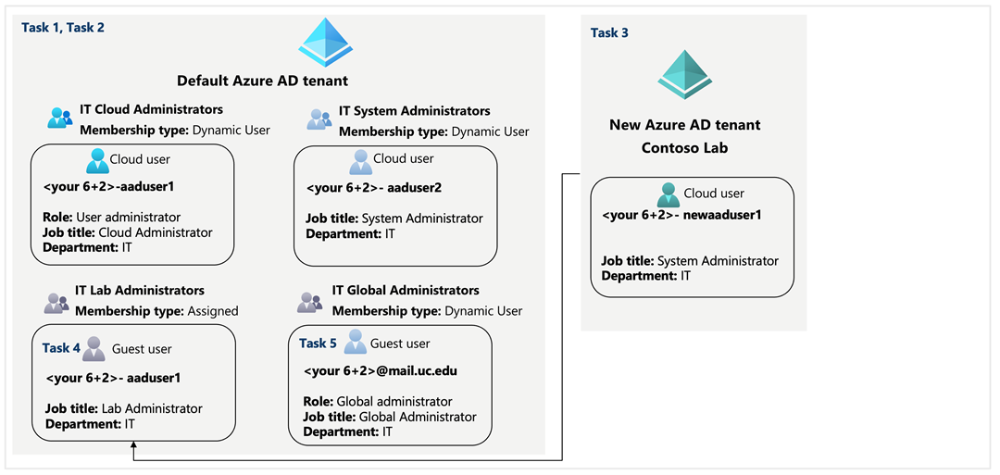
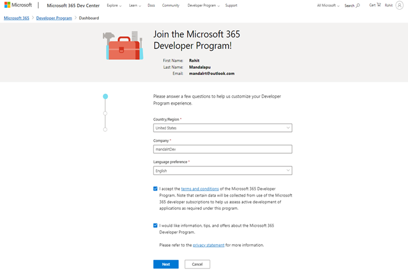
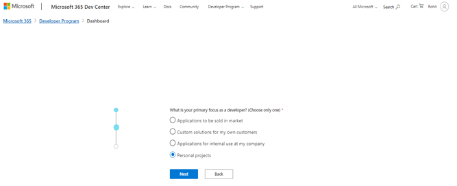
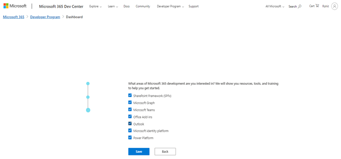
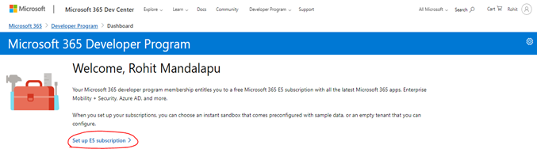
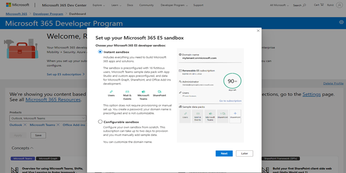
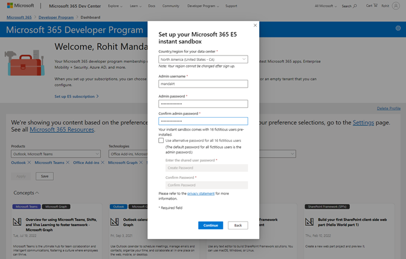
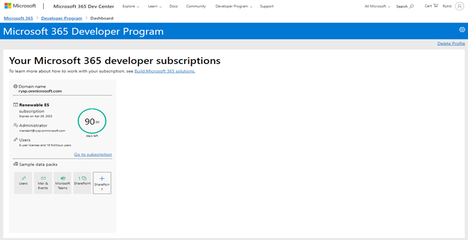

---
lab:
    title: '01 - Manage Azure Active Directory Identities'
    module: 'Administer Identity'
---

# Lab 01 - Manage Azure Active Directory Identities

# Student lab manual

## Lab scenario

In order to allow users from your organization to authenticate by using Azure AD, you have been tasked with provisioning users and group accounts. Membership of the groups should be updated automatically based on the user job titles. You also need to create a test Azure AD tenant with a test user account and grant that account limited permissions to resources in the Contoso Azure subscription. You are required to add your UC-email to your organization and grant that account limited permissions to resources in your organization.

**Note:** An **[interactive lab simulation](https://mslabs.cloudguides.com/guides/AZ-104%20Exam%20Guide%20-%20Microsoft%20Azure%20Administrator%20Exercise%201)** is available that allows you to click through this lab at your own pace. You may find slight differences between the interactive simulation and the hosted lab, but the core concepts and ideas being demonstrated are the same.
Please read through the document and learn any concepts you are not clear about from the Microsoft documents and the course content provided in the module.

## Objectives

In this lab, you will:

•	Task 1: Create and configure Azure AD users

•	Task 2: Create Azure AD groups with assigned and dynamic membership

•	Task 3: Create an Azure Active Directory (AD) tenant

•	Task 4: Manage Azure AD guest users

•	Task 5: Manage Azure AD guest user from University of Cincinnati. 

>**Note**: Through out the lab replace <6+2> with you UC Id. (In my case mandalrt)

## Estimated timing: 30 minutes

## Architecture diagram

## Instructions

1. Create a new Microsoft email at Create account (live.com)
Email: <6+2>@outlook.com example: mandalrt@outlook.com
Password: Give as per your choice
First name and Last name as per the registration at UC.
Save this information for your future use in the course.

2. Join the Microsoft 365 Developer Program using the email created at [Developer Program | Microsoft 365 Dev Center by clicking Join](https://developer.microsoft.com/en-us/microsoft-365/dev-program)

3. You will need to give below details to begin with, use ‘<6+2>Dev’ as your company in my case it was ‘mandalrtDev’

4. Now signup for the E5 Subscription

5. Use your 6+2 as your username in my case it was mandalrt

6. Save your username and password for future use in the course. You will be asked for recovery phone when you click continue, once you verify your phone number and click setup you subscription will be activated and see the screen as below, it will create additional users for your use at this stage. 

>**[Screenshot 1](https://github.com/venkatvvg/AZ-104-MicrosoftAzureAdministrator-master/blob/master/Instructions/Labs/LAB_01-Manage_Azure_AD_Identities.md)**: Showing the subscription is activated.

### Exercise 1

#### Task 1: Create and configure Azure AD users

In this task, you will create and configure Azure AD users.

1. Sign in to the [Azure portal](https://portal.azure.com) in new tab and login using the email and password saved in the above step.

1. In the Azure portal, search for and select **Azure Active Directory**.

1. On the Azure Active Directory blade, scroll down to the **Manage** section, click **User settings**, and review available configuration options.

1. On the Azure Active Directory blade, in the **Manage** section, click **Users**, and then click your user account to display its **Profile** settings. 

1. Click **edit**, in the **Settings** section, set **Usage location** to **United States** and click **save** to apply the change.

    >**Note**: This is necessary in order to assign an Azure AD Premium P2 license to your user account later in this lab.

1. Navigate back to the **Users - All users** blade, and then click **+ New user**.

1. Create a new user with the following settings (leave others with their defaults):

    | Setting | Value |
    | --- | --- |
    | User name | **<6+2>-az104-01a-aaduser1** |
    | Name | **<6+2>-az104-01a-aaduser1** |
    | Let me create the password | enabled |
    | Initial password | **Provide a secure password** |
    | Usage location | **United States** |
    | Job title | **Cloud Administrator** |
    | Department | **IT** |

    >**[Screenshot 2](https://github.com/venkatvvg/AZ-104-MicrosoftAzureAdministrator-master/blob/master/Instructions/Labs/LAB_01-Manage_Azure_AD_Identities.md)**: Showing the Newly created user.

    >**Note**: **Copy to clipboard** the full **User Principal Name** (user name plus domain). You will need it later in this task.

1. In the list of users, click the newly created user account to display its blade.

1. Review the options available in the **Manage** section and note that you can identify the Azure AD roles assigned to the user account as well as the user account's permissions to Azure resources.

1. In the **Manage** section, click **Assigned roles**, then click **+ Add assignment** button and assign the **User administrator** role to **<6+2>az104-01a-aaduser1**.

    >**Note**: You also have the option of assigning Azure AD roles when provisioning a new user.

1. Open an **InPrivate** browser window and sign in to the [Azure portal](https://portal.azure.com) using the newly created user account. When prompted to update the password, change the password to a secure password of your choosing. 

    >**Note**: Rather than typing the user name (including the domain name), you can paste the content of Clipboard.

1. In the **InPrivate** browser window, in the Azure portal, search for and select **Azure Active Directory**.

    >**Note**: While this user account can access the Azure Active Directory tenant, it does not have any access to Azure resources. This is expected, since such access would need to be granted explicitly by using Azure Role-Based Access Control. 

1. In the **InPrivate** browser window, on the Azure AD blade, scroll down to the **Manage** section, click **User settings**, and note that you do not have permissions to modify any configuration options.

    >**[Screenshot 3](https://github.com/venkatvvg/AZ-104-MicrosoftAzureAdministrator-master/blob/master/Instructions/Labs/LAB_01-Manage_Azure_AD_Identities.md)**: Showing user doesn't have permissions
1. In the **InPrivate** browser window, on the Azure AD blade, in the **Manage** section, click **Users**, and then click **+ New user**.

1. Create a new user with the following settings (leave others with their defaults):

    | Setting | Value |
    | --- | --- |
    | User name | **<6+2>-az104-01a-aaduser2** |
    | Name | **<6+2>-az104-01a-aaduser2** |
    | Let me create the password | enabled |
    | Initial password | **Provide a secure password** |
    | Usage location | **United States** |
    | Job title | **System Administrator** |
    | Department | **IT** |
    
    >**[Screenshot 4](https://github.com/venkatvvg/AZ-104-MicrosoftAzureAdministrator-master/blob/master/Instructions/Labs/LAB_01-Manage_Azure_AD_Identities.md)**: Showing the newly created user 2.

1. Sign out as the <6+2>-az104-01a-aaduser1 user from the Azure portal and close the InPrivate browser window.

#### Task 2: Create Azure AD groups with assigned and dynamic membership

In this task, you will create Azure Active Directory groups with assigned and dynamic membership.

1. In the Azure portal, navigate back to the Azure AD tenant blade and click **Groups**.

1. Use the **+ New group** button to create a new group with the following settings:

    | Setting | Value |
    | --- | --- |
    | Group type | **Security** |
    | Group name | **IT Cloud Administrators** |
    | Group description | **UC SoIT IT cloud administrators** |
    | Membership type | **Dynamic User** |

    >**Note**: If the **Membership type** drop-down list is grayed out, wait a few minutes and refresh the browser page.

1. Click **Add dynamic query**.

1. On the **Configure Rules** tab of the **Dynamic membership rules** blade, create a new rule with the following settings:

    | Setting | Value |
    | --- | --- |
    | Property | **jobTitle** |
    | Operator | **Equals** |
    | Value | **Cloud Administrator** |

1. Save the rule by clicking **+Add expression** and **Save**. Back on the **New Group** blade, click **Create**. 

1. Back on the **Groups - All groups** blade of the Azure AD tenant, click the **+ New group** button and create a new group with the following settings:

    | Setting | Value |
    | --- | --- |
    | Group type | **Security** |
    | Group name | **IT System Administrators** |
    | Group description | **UC SoIT IT system administrators** |
    | Membership type | **Dynamic User** |

1. Click **Add dynamic query**.

1. On the **Configure Rules** tab of the **Dynamic membership rules** blade, create a new rule with the following settings:

    | Setting | Value |
    | --- | --- |
    | Property | **jobTitle** |
    | Operator | **Equals** |
    | Value | **System Administrator** |

1. Save the rule by clicking **+Add expression** and **Save**. Back on the **New Group** blade, click **Create**. 

1. Back on the **Groups - All groups** blade of the Azure AD tenant, click the **+ New group** button, and create a new group with the following settings:

    | Setting | Value |
    | --- | --- |
    | Group type | **Security** |
    | Group name | **IT Lab Administrators** |
    | Group description | **UC SoIT IT Lab administrators** |
    | Membership type | **Assigned** |
    
1. Click **No members selected**.

1. From the **Add members** blade, search and select the **IT Cloud Administrators** and **IT System Administrators** groups and, back on the **New Group** blade, click **Create**.

1. Back on the **Groups - All groups** blade, click the entry representing the **IT Cloud Administrators** group and, on then display its **Members** blade. Verify that the **<6+2>az104-01a-aaduser1** appears in the list of group members.

    >**[Screenshot 5](https://github.com/venkatvvg/AZ-104-MicrosoftAzureAdministrator-master/blob/master/Instructions/Labs/LAB_01-Manage_Azure_AD_Identities.md)**: Showing the User 1 name added to IT Cloud administrator.

    >**Note**: You might experience delays with updates of the dynamic membership groups. To expedite the update, navigate to the group blade, display its **Dynamic membership rules** blade, **Edit** the rule listed in the **Rule syntax** textbox by adding a whitespace at the end, and **Save** the change.

1. Navigate back to the **Groups - All groups** blade, click the entry representing the **IT System Administrators** group and, on then display its **Members** blade. Verify that the **<6+2>az104-01a-aaduser2** appears in the list of group members.

    >**[Screenshot 6](https://github.com/venkatvvg/AZ-104-MicrosoftAzureAdministrator-master/blob/master/Instructions/Labs/LAB_01-Manage_Azure_AD_Identities.md)**: Showing the User 2 name added to IT system administrator.

#### Task 3: Create an Azure Active Directory (AD) tenant (Optional - Lab environment issue)

In this task, you will create a new Azure AD tenant.

   >**Note**: There is a known issue with the Captcha verification in the lab environment. If you experience this issue, please skip both this task and the next. We are working on a solution.

1. In the Azure portal, search for and select **Azure Active Directory**.

1. Click **Manage tenants**, and then on the next screen, click **+ Create**, and specify the following setting:

    | Setting | Value |
    | --- | --- |
    | Directory type | **Azure Active Directory** |
    
1. Click **Next : Configuration**

    | Setting | Value |
    | --- | --- |
    | Organization name | **<6+2>lab** eg:mandalrtlab|
    | Initial domain name | **<6+2>ad** eg: mandalrtad| 
    | Country/Region | **United States** |

1. Click **Review + create** and then click **Create**.

1. Display the blade of the newly created Azure AD tenant by using the **Click here to navigate to your new tenant: Contoso Lab** link or the **Directory + Subscription** button (directly to the right of the Cloud Shell button) in the Azure portal toolbar.

    >**[Screenshot 7](https://github.com/venkatvvg/AZ-104-MicrosoftAzureAdministrator-master/blob/master/Instructions/Labs/LAB_01-Manage_Azure_AD_Identities.md)**: Showing the newly created azure tenant.

#### Task 4: Manage Azure AD guest users.

In this task, you will create Azure AD guest users and grant them access to resources in an Azure subscription.

1. In the Azure portal displaying the Contoso Lab Azure AD tenant, in the **Manage** section, click **Users**, and then click **+ New user**.

1. Create a new user with the following settings (leave others with their defaults):

    | Setting | Value |
    | --- | --- |
    | User name | **<6+2>-az104-01b-aaduser1** |
    | Name | **<6+2>-az104-01b-aaduser1** |
    | Let me create the password | enabled |
    | Initial password | **Provide a secure password** |
    | Job title | **System Administrator** |
    | Department | **IT** |

    >**[Screenshot 8](https://github.com/venkatvvg/AZ-104-MicrosoftAzureAdministrator-master/blob/master/Instructions/Labs/LAB_01-Manage_Azure_AD_Identities.md)**: Displaying Newly created user.
    
1. Click on the newly created profile.

    >**Note**: **Copy to clipboard** the full **User Principal Name** (user name plus domain). You will need it later in this task.

1. Switch back to your default Azure AD tenant by using the **Directory + Subscription** button (directly to the right of the Cloud Shell button) in the Azure portal toolbar.

1. Navigate back to the **Users - All users** blade, and then click **+ Invite external user**.

1. Invite a new guest user with the following settings (leave others with their defaults):

    | Setting | Value |
    | --- | --- |
    | Name | **<6+2>-az104-01b-aaduser1** |
    | Email address | the User Principal Name you copied earlier in this task |
    | Usage location | **United States** |
    | Job title | **Lab Administrator** |
    | Department | **IT** |

1. Click **Invite**. 

1. Back on the **Users - All users** blade, click the entry representing the newly created guest user account.

    >**[Screenshot 9](https://github.com/venkatvvg/AZ-104-MicrosoftAzureAdministrator-master/blob/master/Instructions/Labs/LAB_01-Manage_Azure_AD_Identities.md)**: Showing Profile of guest user

1. On the **<6+2>-az104-01b-aaduser1 - Profile** blade, click **Groups**.

1. Click **+ Add membership** and add the guest user account to the **IT Lab Administrators** group.

    >**[Screenshot 10](https://github.com/venkatvvg/AZ-104-MicrosoftAzureAdministrator-master/blob/master/Instructions/Labs/LAB_01-Manage_Azure_AD_Identities.md)**: Showing members of IT Lab Administrators.

#### Task 5: Manage Azure AD guest user from University of Cincinnati.

1. Verify the architecture diagram and understand the requirement for task 5. 

Invite External user: **<6+2>@mail.uc.edu**

Role: **Global Administrator**

Job Title: **Global Administrator**

Department: **IT**

1. You are required to invite UC user to your organization for this exercise you will use your UC mail for inviting.

     >**[Screenshot 10](https://github.com/venkatvvg/AZ-104-MicrosoftAzureAdministrator-master/blob/master/Instructions/Labs/LAB_01-Manage_Azure_AD_Identities.md)**: Show the properties of the user added.

    >**[Screenshot 11](https://github.com/venkatvvg/AZ-104-MicrosoftAzureAdministrator-master/blob/master/Instructions/Labs/LAB_01-Manage_Azure_AD_Identities.md)**: Show the assigned roles 

     >**[Screenshot 12](https://github.com/venkatvvg/AZ-104-MicrosoftAzureAdministrator-master/blob/master/Instructions/Labs/LAB_01-Manage_Azure_AD_Identities.md)**: Show the list of users in the group to which the external user was added. 

#### Review

In this lab, you have:

- Created and configured Azure AD users
- Created Azure AD groups with assigned and dynamic membership
- Created an Azure Active Directory (AD) tenant
- Managed Azure AD guest users 
