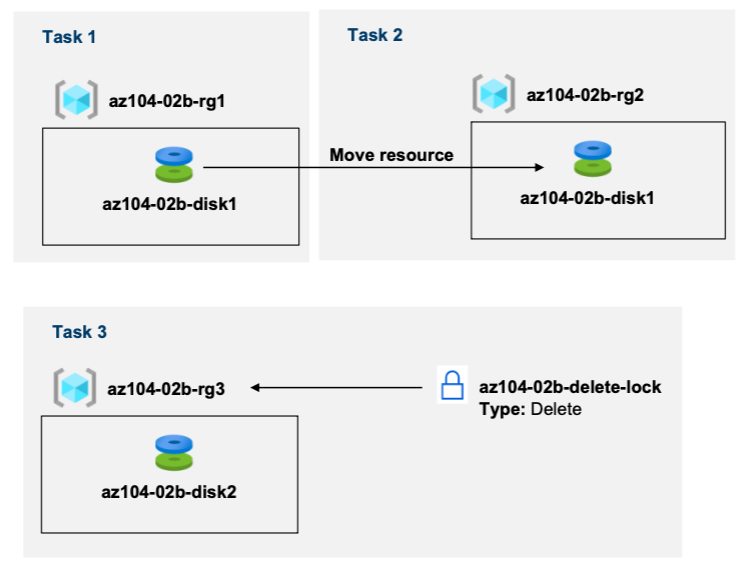

---
lab:
    title: '2b - Manage Azure resources by Using the Azure Portal'
    module: 'Administer Azure Resources'
---

# Lab 02b - Manage Azure resources by Using the Azure Portal
# Student lab manual

## Lab scenario

You need to explore the basic Azure administration capabilities associated with provisioning resources and organizing them based on resource groups, including moving resources between resource groups. You also want to explore options for protecting disk resources from being accidentally deleted, while still allowing for modifying their performance characteristics and size.

**Note:** An **[interactive lab simulation](https://mslabs.cloudguides.com/guides/AZ-104%20Exam%20Guide%20-%20Microsoft%20Azure%20Administrator%20Exercise%204)** is available that allows you to click through this lab at your own pace. You may find slight differences between the interactive simulation and the hosted lab, but the core concepts and ideas being demonstrated are the same. 

## Objectives

In this lab, we will:

+ Task 1: Create resource groups and deploy resources to resource groups
+ Task 2: Move resources between resource groups
+ Task 3: Implement and test resource locks

## Estimated timing: 20 minutes

## Architecture diagram

## Instructions

### Exercise 1

#### Task 1: Create resource groups and deploy resources to resource groups

In this task, you will use the Azure portal to create resource groups and create a disk in the resource group.

1. Sign in to the [**Azure portal**](https://portal.azure.com) and login using the uc mail ID click profile and switch directory to CECH SoIT Bootcamp.

1. In the Azure portal, search for and select **Disks**, click **+ Create** and specify the following settings:

    |Setting|Value|
    |---|---|
    |Subscription| the name of the Azure subscription where you created the resource group |
    |Resource Group| the name of a new resource group **<6+2>-az104-02b-rg1** |
    |Disk name| **<6+2>-az104-02b-disk1** |
    |Region| **(US) East US** |
    |Availability zone| **None** |
    |Source type| **None** |

    >**Note**: When creating a resource, you have the option of creating a new resource group or using an existing one.

1. Under the Disk Details -> Size ->Select **Change size** -> Disk SKU -> **Standard HDD** -> 32GB

    >**Note**: Make sure you select standard HDD with 32GB

1. Change the disk type and size to **Standard HDD** and **32 GiB**, respectively.

1. Click **Review + Create** and then click **Create**.

    >**Note**: Wait until the disk is created. This should take less than a minute.
    
    >**[Screenshot 1](https://github.com/venkatvvg/AZ-104-MicrosoftAzureAdministrator-master/blob/master/Instructions/Labs/LAB_02b-Manage_Azure_Resources_by_Using_the_Azure_Portal.md)**: Show the overview of **Disk <6+2>-az104-02b-disk1** you created.

#### Task 2: Move resources between resource groups 

In this task, we will move the disk resource you created in the previous task to a new resource group. 

1. Search for and select **Resource groups**. 

1. On the **Resource groups** blade, click the entry representing the **<6+2>-az104-02b-rg1** resource group you created in the previous task.

1. From the **Overview** blade of the resource group, in the list of resource group resources, select the entry representing the newly created disk, click **Move** in the toolbar, and, in the drop-down list, select **Move to another resource group**.

    >**Note**: This method allows you to move multiple resources at the same time. 

1. Below the **Resource group** text box, click **Create new** then type **<6+2>-az104-02b-rg2** in the text box and click Next (Wait till the change gets validated), Click next to move to the Review tab, select the checkbox **I understand that tools and scripts associated with moved resources will not work until I update them to use new resource IDs**, and click **Move**.

    >**Note**: Do not wait for the move to complete but instead proceed to the next task. The move might take about 10 minutes. You can determine that the operation was completed by monitoring activity log entries of the source or target resource group. Revisit this step once you complete the next task.
   
    >**[Screenshot 2](https://github.com/venkatvvg/AZ-104-MicrosoftAzureAdministrator-master/blob/master/Instructions/Labs/LAB_02b-Manage_Azure_Resources_by_Using_the_Azure_Portal.md)**: Show the overview of **Disk <6+2>-az104-02b-disk1** you Moved.

#### Task 3: Implement resource locks

In this task, you will apply a resource lock to an Azure resource group containing a disk resource.

1. In the Azure portal, search for and select **Disks**, click **+ Create** and specify the following settings:

    |Setting|Value|
    |---|---|
    |Subscription| the name of the subscription you are using in this lab |
    |Resource Group| click **create new** resource group and name it **<6+2>-az104-02b-rg3** |
    |Disk name| **<6+2>-az104-02b-disk2** |
    |Region| the name of the Azure region where you created the other resource groups in this lab |
    |Availability zone| **None** |
    |Source type| **None** |

1.  Under the Disk Details -> Size ->Select **Change size** -> Disk SKU -> **Standard HDD** -> 32GB

    >**Note**: Make sure you select standard HDD with 32GB

1. Click **Review + Create** and then click **Create**.

1. Click **Go to resource**.

    >**[Screenshot 3](https://github.com/venkatvvg/AZ-104-MicrosoftAzureAdministrator-master/blob/master/Instructions/Labs/LAB_02b-Manage_Azure_Resources_by_Using_the_Azure_Portal.md)**: Show the overview of **Disk <6+2>-az104-02b-disk2** you Moved.

1. On the Overview page of the Disk, click the name of the resource group, **<6+2>-az104-02b-rg3**.

1. On the **<6+2>-az104-02b-rg3** resource group blade, click **Locks** then **+ Add** and specify the following settings:

    |Setting|Value|
    |---|---|
    |Lock name| **<6+2>-az104-02b-delete-lock** |
    |Lock type| **Delete** |
    
1. Click **OK**    

1. On the **<6+2>-az104-02b-rg3** resource group blade, click **Overview**, in the list of resource group resources, select the entry representing the disk you created earlier in this task, and click **Delete** in the toolbar. 

1. When prompted **Do you want to delete all the selected resources?**, in the **Confirm delete** text box, type **delete** and click **Delete**.

1. You should see an error message, notifying about the failed delete operation. 

    >**Note**: As the error message states, this is expected due to the delete lock applied on the resource group level.
    
    >**[Screenshot 4](https://github.com/venkatvvg/AZ-104-MicrosoftAzureAdministrator-master/blob/master/Instructions/Labs/LAB_02b-Manage_Azure_Resources_by_Using_the_Azure_Portal.md)**: Show the error you received when trying to delete the **Disk 6+2>-az104-02b-disk2**.

1. Navigate back to the list of resources of the **<6+2>-az104-02b-rg3** resource group and click the entry representing the **<6+2>-az104-02b-disk2** resource. 

1. Navigate to **<6+2>-az104-02b-disk2**, in the **Settings** section, click **Size + performance**, change **Disk SKU** to **Premium SSD** and size as **64 GiB**, respectively, and click **Save** to apply the change. Verify that the change was successful.

    >**Note**: This is expected, since the resource group-level lock applies to delete operations only. 
    
    >**[Screenshot 4](https://github.com/venkatvvg/AZ-104-MicrosoftAzureAdministrator-master/blob/master/Instructions/Labs/LAB_02b-Manage_Azure_Resources_by_Using_the_Azure_Portal.md)**: Show the overview of **Disk <6+2>-az104-02b-disk2** you Moved.

#### Review

In this lab, you have:

- Created resource groups and deployed resources to resource groups
- Moved resources between resource groups
- Implemented and tested resource locks
