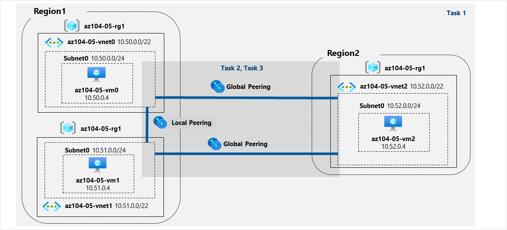

---
lab:
    title: '05 - Implement Intersite Connectivity'
    module: 'Administer Intersite Connectivity'
---

# Lab 05 - Implement Intersite Connectivity
# Student lab manual

## Lab scenario

Contoso has its datacenters in Boston, New York, and Seattle offices connected via a mesh wide-area network links, with full connectivity between them. You need to implement a lab environment that will reflect the topology of the Contoso's on-premises networks and verify its functionality.

**Note:** An **[interactive lab simulation](https://mslabs.cloudguides.com/guides/AZ-104%20Exam%20Guide%20-%20Microsoft%20Azure%20Administrator%20Exercise%209)** is available that allows you to click through this lab at your own pace. You may find slight differences between the interactive simulation and the hosted lab, but the core concepts and ideas being demonstrated are the same. 

## Objectives

In this lab, you will:

+ Task 1: Provision the lab environment
+ Task 2: Configure local and global virtual network peering
+ Task 3: Test intersite connectivity

## Estimated timing: 30 minutes

## Architecture diagram



### Instructions

#### Task 1: Provision the lab environment

In this task, you will deploy three virtual machines, each into a separate virtual network, with two of them in the same Azure region and the third one in another Azure region.

1. Sign in to the [**Azure portal**](https://portal.azure.com) and login using the uc mail ID click profile and switch directory to CECH SoIT Bootcamp.

1. In the Azure portal, open the **Azure Cloud Shell** by clicking on the icon in the top right of the Azure Portal.

1. If prompted to select either **Bash** or **PowerShell**, select **PowerShell**.

1. From the Cloud Shell pane, click advanced settings using following:

   ```powershell
   Resource Group -> Use existing -> <6+2>-az-104-05-rg1   eg:madalrt-az-104-05-rg1 
   ```
   ```powershell
   Storage Account -> Create New -> <6+2>05storage eg:madalrt05storage 
   ```
   ```powershell
   File Share -> Create New -> <6+2>05fs  eg:madalrt05fs  
   ```
    >**Note**: If powershell open automatically click Settings --> Reset user settings, Repeat above steps**.

    >**Note**: If this is the first time you are starting **Cloud Shell** and you are presented with the **You have no storage mounted** message, select the subscription you are using in this lab, and click **Create storage**.

1. Download the two files **[\\Allfiles\\Labs\\05\\az104-05-vnetvm-loop-template.json](https://drive.google.com/file/d/1M48OGV42tyWxg5ud0Ze2MLq9Lo-YiBVL/view?usp=sharing)** and **[\\Allfiles\\Labs\\05\\az104-05-vnetvm-loop-parameters.json](https://drive.google.com/file/d/1QGt3DEwz7XcOO7EcZiStpON4d9yEPjoL/view?usp=sharing)**.

1. Edit the Parameters file using notepad, change the password (your password should be 8-16 character length and should have uppercase character, lowercase character, numeric digit, special character and cannot have Control characters) Click **Save**.

1. Edit the templete file in the notepad and replace <6+2> with your 6+2 example: mandalrt, Click **Save**. 

1. In the toolbar of the Cloud Shell pane, click the **Upload/Download files** icon, in the drop-down menu, click **Upload**. Upload **

    >**Note**: You must upload each file separately. After uploading, use **dir** to ensure both files were successfully uploaded.

1. From the Cloud Shell pane, run the following to create the resource group that will be hosting the lab environment. The first two virtual networks and a pair of virtual machines will be deployed in [Azure_region_1]. The third virtual network and the third virtual machine will be deployed in the same resource group but another [Azure_region_2]. (replace the [Azure_region_1] and [Azure_region_2] placeholder, including the square brackets, with the names of two different Azure regions where you intend to deploy these Azure virtual machines. An example is $location1 = 'eastus'. You can use Get-AzLocation to list all locations.):

   ```powershell
   $location1 = 'eastus'
   ```
   
   
   ```powershell
   $location2 = 'westus'
   ```


   ```powershell
   $rgName = '<6+2>-az104-05-rg1'
   ```

   ```powershell
   New-AzResourceGroup -Name $rgName -Location $location1
   ```

   >**Note**: The regions used above were tested and known to work when this lab was last officially reviewed. If you would prefer to use different locations, or they no longer work, you will need to identify two different regions that Standard D2Sv3 virtual machines can be deployed into.
   >
   >In order to identify Azure regions, from a PowerShell session in Cloud Shell, run **(Get-AzLocation).Location**
   >
   >Once you have identified two regions you would like to use, run the command below in the Cloud Shell for each region to confirm that you can deploy Standard D2Sv3 virtual machines
   >
   >```az vm list-skus --location <Replace with your location> -o table --query "[? contains(name,'Standard_D2s')].name" ```
   >
   >If the command returns no results, then you need to choose another region. Once you have identified two suitable regions, you can adjust the regions in the code block above.

1. From the Cloud Shell pane, run the following to create the three virtual networks and deploy virtual machines into them by using the template and parameter files you uploaded:

   ```powershell
   New-AzResourceGroupDeployment `
      -ResourceGroupName $rgName `
      -TemplateFile $HOME/az104-05-vnetvm-loop-template.json `
      -TemplateParameterFile $HOME/az104-05-vnetvm-loop-parameters.json `
      -location1 $location1 `
      -location2 $location2
   ```

    >**Note**: Wait for the deployment to complete before proceeding to the next step. This should take about 2 minutes.
    
    >**[Screenshot 1](https://github.com/venkatvvg/AZ-104-MicrosoftAzureAdministrator-master/blob/master/Instructions/Labs/LAB_05-Implement_Intersite_Connectivity.md)**: Show the successful run of the cloud shell resource group deployement.

1. Close the Cloud Shell pane.

#### Task 2: Configure local and global virtual network peering

In this task, you will configure local and global peering between the virtual networks you deployed in the previous tasks.

1. In the Azure portal, search for and select **Resource Groups**.

1. Review the resource group you created in the previous task 
    
1. Check the virtual networks and verify that the first two (<6+2>-vnet0, <6+2>-vnet1) are located in the same Azure region (East US) and the third one (<6+2>-vnet2) in a different Azure region (West US).
    
1. Click <6+2>-vnet0, in the **settings** section, click **properties**, copy the resource ID and paste it in a notepad we will be using this resource ID in next steps.
    
1. Repeat the above steps for <6+2>-vnet1 & <6+2>-vnet2.
    
    >**Example of Resource ID**: /subscriptions/12351f3d-xxxx-xxxx-xxxx-fc359ee9xxxx/resourceGroups/xxxxxx-az104-05-rg1/providers/Microsoft.Network/virtualNetworks/<6+2>-vnet0.

    >**Note**: The template you used for deployment of the three virtual networks ensures that the IP address ranges of the three virtual networks do not overlap.

1. In the list of virtual networks, click **<6+2>-vnet0**.

1. On the **<6+2>-vnet0** virtual network blade, in the **Settings** section, click **Peerings** and then click **+ Add**.

1. Add a peering with the following settings (leave others with their default values) and click **Add**:

    | Setting | Value|
    | --- | --- |
    | This virtual network: Peering link name | **<6+2>-vnet0_to_<6+2>-vnet1** |
    | This virtual network: Traffic to remote virtual network | **Allow (default)** |
    | This virtual network: Traffic forwarded from remote virtual network | **Block traffic that originates from outside this virtual network** |
    | Virtual network gateway | **None** |
    | Remote virtual network: Peering link name | **<6+2>-vnet1_to_<6+2>-vnet0** |
    | Virtual network deployment model | **Resource manager** |
    | I know my resource ID | **selected** |
    | Resource ID | Resource ID of vnet1 (The ID is copied is previous step) |
    | Traffic to remote virtual network | **Allow (default)** |
    | Traffic forwarded from remote virtual network | **Block traffic that originates from outside this virtual network** |
    | Virtual network gateway | **None** |

    >**Note**: This step establishes two local peerings - one from <6+2>-vnet0 to <6+2>-vnet1 and the other from <6+2>-vnet1 to <6+2>-vnet0.


1. On the **<6+2>-vnet0** virtual network blade, in the **Settings** section, click **Peerings** and then click **+ Add**.

1. Add a peering with the following settings (leave others with their default values) and click **Add**:

    | Setting | Value|
    | --- | --- |
    | This virtual network: Peering link name | **<6+2>-vnet0_to_<6+2>-vnet2** |
    | This virtual network: Traffic to remote virtual network | **Allow (default)** |
    | This virtual network: Traffic forwarded from remote virtual network | **Block traffic that originates from outside this virtual network** |
    | Virtual network gateway | **None** |
    | Remote virtual network: Peering link name | **<6+2>-vnet2_to_<6+2>-vnet0** |
    | Virtual network deployment model | **Resource manager** |
    | I know my resource ID | **selected** |
    | Resource ID | Resource ID of vnet2 (The ID is copied is previous step) |
    | Traffic to remote virtual network | **Allow (default)** |
    | Traffic forwarded from remote virtual network | **Block traffic that originates from outside this virtual network** |
    | Virtual network gateway | **None** |

    >**Note**: This step establishes two global peerings - one from <6+2>-vnet0 to <6+2>-vnet2 and the other from <6+2>-vnet2 to <6+2>-vnet0.


1. Open the cloud shell on the top navigation bar and run the Following commands. Make sure you replace <6+2> with your UCID (eg:mandalrt):
    
   ```powershell
   $rgName = '<6+2>-az104-05-rg1'
   ``` 
   ```powershell
   $vnet1 = Get-AzVirtualNetwork -Name '<6+2>-vnet1' -ResourceGroupName $rgname
   ``` 
   ```powershell
   $vnet2 = Get-AzVirtualNetwork -Name '<6+2>-vnet2' -ResourceGroupName $rgname
   ``` 
   ```powershell
   Add-AzVirtualNetworkPeering -Name '<6+2>-vnet1_to_<6+2>-vnet2' -VirtualNetwork $vnet1 -RemoteVirtualNetworkId $vnet2.Id
   ``` 
   ```powershell
   Add-AzVirtualNetworkPeering -Name '<6+2>-vnet2_to_<6+2>-vnet1' -VirtualNetwork $vnet2 -RemoteVirtualNetworkId $vnet1.Id
   ``` 
    
    >**Note**: This step establishes two global peerings - one from az104-05-vnet1 to <6+2>-vnet2 and the other from <6+2>-vnet2 to <6+2>-vnet1.

    >**[Screenshot 2](https://github.com/venkatvvg/AZ-104-MicrosoftAzureAdministrator-master/blob/master/Instructions/Labs/LAB_05-Implement_Intersite_Connectivity.md)**: Show the output of all five (5) commands.

#### Task 3: Test intersite connectivity

In this task, you will test connectivity between virtual machines on the three virtual networks that you connected via local and global peering in the previous task.

1. In the Azure portal, search for and select **Virtual machines**.

1. In the list of virtual machines, click **<6+2>-vm0**.

1. On the **<6+2>-vm0** blade, click **Connect**, in the drop-down menu, click **RDP**, on the **Connect with RDP** blade, click **Download RDP File** and follow the prompts to start the Remote Desktop session.

    >**Note**: This step refers to connecting via Remote Desktop from a Windows computer. On a Mac, you can use Remote Desktop Client from the Mac App Store and on Linux computers you can use an open source RDP client software.

    >**Note**: You can ignore any warning prompts when connecting to the target virtual machines.

1. When prompted, sign in by using the **Student** username and the password from your parameters file. 

1. Within the Remote Desktop session to **<6+2>-vm0**, right-click the **Start** button and, in the right-click menu, click **Windows PowerShell (Admin)**.

1. In the Windows PowerShell console window, run the following to test connectivity to **<6+2>-vm1** (which has the private IP address of **10.51.0.4**) over TCP port 3389:

   ```powershell
   Test-NetConnection -ComputerName 10.51.0.4 -Port 3389 -InformationLevel 'Detailed'
   ```

    >**Note**: The test uses TCP 3389 since this is this port is allowed by default by operating system firewall.

    >**[Screenshot 3](https://github.com/venkatvvg/AZ-104-MicrosoftAzureAdministrator-master/blob/master/Instructions/Labs/LAB_05-Implement_Intersite_Connectivity.md)**: Show the output of the command.

1. Examine the output of the command and verify that the connection was successful.

1. In the Windows PowerShell console window, run the following to test connectivity to **<6+2>-vm2** (which has the private IP address of **10.52.0.4**):

   ```powershell
   Test-NetConnection -ComputerName 10.52.0.4 -Port 3389 -InformationLevel 'Detailed'
   ```
    >**[Screenshot 4](https://github.com/venkatvvg/AZ-104-MicrosoftAzureAdministrator-master/blob/master/Instructions/Labs/LAB_05-Implement_Intersite_Connectivity.md)**: Show the output of the command.

1. Switch back to the Azure portal on your lab computer and navigate back to the **Virtual machines** blade.

1. In the list of virtual machines, click **<6+2>-vm1**.

1. On the **<6+2>-vm1** blade, click **Connect**, in the drop-down menu, click **RDP**, on the **Connect with RDP** blade, click **Download RDP File** and follow the prompts to start the Remote Desktop session.

    >**Note**: This step refers to connecting via Remote Desktop from a Windows computer. On a Mac, you can use Remote Desktop Client from the Mac App Store and on Linux computers you can use an open source RDP client software.

    >**Note**: You can ignore any warning prompts when connecting to the target virtual machines.

1. When prompted, sign in by using the **Student** username and the password from your parameters file. 

1. Within the Remote Desktop session to **<6+2>-vm1**, right-click the **Start** button and, in the right-click menu, click **Windows PowerShell (Admin)**.

1. In the Windows PowerShell console window, run the following to test connectivity to **<6+2>-vm2** (which has the private IP address of **10.52.0.4**) over TCP port 3389:

   ```powershell
   Test-NetConnection -ComputerName 10.52.0.4 -Port 3389 -InformationLevel 'Detailed'
   ```

    >**Note**: The test uses TCP 3389 since this is this port is allowed by default by operating system firewall.

    >**[Screenshot 5](https://github.com/venkatvvg/AZ-104-MicrosoftAzureAdministrator-master/blob/master/Instructions/Labs/LAB_05-Implement_Intersite_Connectivity.md)**: Show the output of the command.

1. Examine the output of the command and verify that the connection was successful.

#### Clean up resources

>**Note**: Remember to remove the resource group that you created.

1. In the Azure portal, open the **PowerShell** session within the **Cloud Shell** pane.

1. Delete all resource groups you created throughout the labs of this module by running the following command:

   ```powershell
   Get-AzResourceGroup -Name '<6+2>*' | Remove-AzResourceGroup
   ```

    >**Note**: The command executes and takes some time for the execution.

    >**[Screenshot 12](https://github.com/venkatvvg/AZ-104-MicrosoftAzureAdministrator-master/blob/master/Instructions/Labs/LAB_04-Implement_Virtual_Networking.md)**: Azure Cloud Shell Output True

#### Review

In this lab, you have:

+ Provisioned the lab environment
+ Configured local and global virtual network peering
+ Tested intersite connectivity
