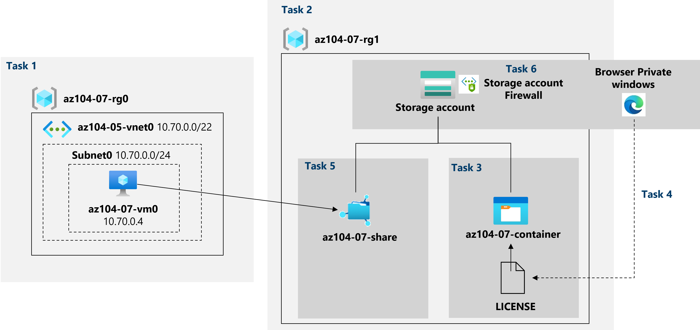

---
lab:
    title: '07 - Manage Azure storage'
    module: 'Administer Azure Storage'
---

# Lab 07 - Manage Azure Storage
# Student lab manual

## Lab scenario

You need to evaluate the use of Azure storage for storing files residing currently in on-premises data stores. While majority of these files are not accessed frequently, there are some exceptions. You would like to minimize cost of storage by placing less frequently accessed files in lower-priced storage tiers. You also plan to explore different protection mechanisms that Azure Storage offers, including network access, authentication, authorization, and replication. Finally, you want to determine to what extent Azure Files service might be suitable for hosting your on-premises file shares.

**Note:** An **[interactive lab simulation](https://mslabs.cloudguides.com/guides/AZ-104%20Exam%20Guide%20-%20Microsoft%20Azure%20Administrator%20Exercise%2011)** is available that allows you to click through this lab at your own pace. You may find slight differences between the interactive simulation and the hosted lab, but the core concepts and ideas being demonstrated are the same. 

## Objectives

In this lab, you will:

+ Task 1: Provision the lab environment
+ Task 2: Create and configure Azure Storage accounts
+ Task 3: Manage blob storage
+ Task 4: Manage authentication and authorization for Azure Storage
+ Task 5: Create and configure an Azure Files shares
+ Task 6: Manage network access for Azure Storage

## Estimated timing: 40 minutes

## Architecture diagram




## Instructions

### Exercise 1

#### Task 1: Provision the lab environment

In this task, you will deploy an Azure virtual machine that you will use later in this lab.

1. Sign in to the [**Azure portal**](https://portal.azure.com) and login using the uc mail ID click profile and switch directory to CECH SoIT Bootcamp.

1. Download the two files **[\\Allfiles\\Labs\\07\\az104-07-vms-loop-template.json](https://drive.google.com/file/d/1Drp9dACWIXoCDYp2LPcle9ta_nT6h5mm/view?usp=sharing)** and **[\\Allfiles\\Labs\\07\\az104-07-vms-loop-parameters.json](https://drive.google.com/file/d/1TSmGpyndBm5TB9hfSO1FupnEGEc6-6YT/view?usp=sharing)**

1. Edit the Parameters file using notepad, change the password (your password should be 8-16 character length and should have uppercase character, lowercase character, numeric digit, special character and cannot have Control characters) Click **Save**.

1. Edit the templete file in the notepad and replace <6+2> with your 6+2 example: mandalrt, Click **Save**. 

1. In the Azure portal, open the **Azure Cloud Shell** by clicking on the icon in the top right of the Azure Portal.

1. If prompted to select either **Bash** or **PowerShell**, select **PowerShell**.

1. From the Cloud Shell pane, click advanced settings using following:

   ```powershell
   Resource Group -> Use existing -> <6+2>-az104-07-rg0   eg:madalrt-az104-07-rg0 
   ```
   ```powershell
   Storage Account -> Create New -> <6+2>07storage eg:madalrt06storage 
   ```
   ```powershell
   File Share -> Create New -> <6+2>07fs  eg:madalrt07fs  
   ```
    >**Note**: If powershell open automatically click Settings --> Reset user settings, Repeat above steps**.

1. In the toolbar of the Cloud Shell pane, click the **Upload/Download files** icon, in the drop-down menu, click **Upload**. Upload **az104-07-vms-loop-template.json** and **az104-07-vms-loop-parameters.json**

    >**Note**: You must upload each file separately. After uploading, use **dir** to ensure both files were successfully uploaded.
    
1. From the Cloud Shell pane, run the following to deploy the virtual machine by using the uploaded template and parameter files:

    ```powershell
        $rgName = '<6+2>-az104-07-rg0'
    ```

   ```powershell
   New-AzResourceGroupDeployment `
      -ResourceGroupName $rgName `
      -TemplateFile $HOME/az104-07-vm-template.json `
      -TemplateParameterFile $HOME/az104-07-vm-parameters.json `
      -AsJob
   ```

    >**Note**: If you got an error stating the VM size is not available please ask your TA for assistance and try these steps.

    >**[Screenshot 1](https://github.com/venkatvvg/AZ-104-MicrosoftAzureAdministrator-master/blob/master/Instructions/Labs/LAB_07-Manage_Azure_Storage.md)**: Show the output of the powershell

1. Close the Cloud Shell pane.

#### Task 2: Create and configure Azure Storage accounts

In this task, you will create and configure an Azure Storage account.

1. In the Azure portal, search for and select **Storage accounts**, and then click **+ Create**.

1. On the **Basics** tab of the **Create storage account** blade, specify the following settings (leave others with their default values):

    | Setting | Value |
    | --- | --- |
    | Subscription | the name of the Azure subscription you are using in this lab |
    | Resource group | the name of a **new** resource group **<6+2>-az104-07-rg1** |
    | Storage account name | **<6+2>sa1** |
    | Region | **East US*  |
    | Performance | **Standard** |
    | Redundancy | **Geo-redundant storage (GRS)** |

1. Click **Next: Advanced >**, on the **Advanced** tab of the **Create storage account** blade, review the available options, accept the defaults, and click **Next: Networking >**.

1. On the **Networking** tab of the **Create storage account** blade, review the available options, accept the default option **Enable public access from all networks** and click **Next: Data protection >**.

1. On the **Data protection** tab of the **Create storage account** blade, review the available options, accept the defaults, click **Review + Create**, wait for the validation process to complete and click **Create**.

    >**Note**: Wait for the Storage account to be created. This should take about 2 minutes.

1. On the deployment blade, click **Go to resource** to display the Azure Storage account blade.

1. On the Storage account blade, in the **Data management** section, click **Redundancy** and note the secondary location. 

1. In the **Redundancy** drop-down list select **Locally redundant storage (LRS)** and save the change. Note, at this point, the Storage account has only the primary location.

1. On the Storage account blade, in the **Settings** section, select **Configuration**. Set **Blob access tier (default)** to **Cool**, and save the change.

    > **Note**: The cool access tier is optimal for data which is not accessed frequently.

    >**[Screenshot 2](https://github.com/venkatvvg/AZ-104-MicrosoftAzureAdministrator-master/blob/master/Instructions/Labs/LAB_07-Manage_Azure_Storage.md)**: Show the Overview of the Storage Account Created.

#### Task 3: Manage blob storage

In this task, you will create a blob container and upload a blob into it.

1. On the Storage account blade **<6+2>07storage**, in the **Data storage** section, click **Containers**.

1. Click **+ Container** and create a container with the following settings:

    | Setting | Value |
    | --- | --- |
    | Name | **<6+2>-container**  |
    | Public access level | **Private (no anonymous access)** |

1. In the list of containers, click **<6+2>-container** and then click **Upload**.

1. Browse to **[\\Allfiles\\Labs\\07\\LICENSE*](https://drive.google.com/file/d/1De_n8Q6PxP0-v_a0NXu6XRAEpVepQQua/view?usp=sharing)* on your lab computer and **Download**.

1. On the **Upload blob** blade, expand the **Advanced** section and specify the following settings (leave others with their default values):

    | Setting | Value |
    | --- | --- |
    | Authentication type | **Account key**  |
    | Blob type | **Block blob** |
    | Block size | **4 MB** |
    | Access tier | **Hot** |
    | Upload to folder | **licenses** |

    > **Note**: Access tier can be set for individual blobs.

1. Click **Upload**.

    > **Note**: Note that the upload automatically created a subfolder named **licenses**.

    >**[Screenshot 3](https://github.com/venkatvvg/AZ-104-MicrosoftAzureAdministrator-master/blob/master/Instructions/Labs/LAB_07-Manage_Azure_Storage.md)**: Show the subfolder named **licenses**.

1. Back on the **<6+2>-container** blade, click **licenses** and then click **LICENSE**.

1. On the **licenses/LICENSE** blade, review the available options.

    > **Note**: You have the option to download the blob, change its access tier (it is currently set to **Hot**), acquire a lease, which would change its lease status to **Locked** (it is currently set to **Unlocked**) and protect the blob from being modified or deleted, as well as assign custom metadata (by specifying an arbitrary key and value pairs). You also have the ability to **Edit** the file directly within the Azure portal interface, without downloading it first. You can also create snapshots, as well as generate a SAS token (you will explore this option in the next task).

#### Task 4: Manage authentication and authorization for Azure Storage

In this task, you will configure authentication and authorization for Azure Storage.

1. On the **licenses/LICENSE** blade, on the **Overview** tab, click **Copy to clipboard** button next to the **URL** entry.

1. Open another browser window by using InPrivate mode and navigate to the URL you copied in the previous step.

1. You should be presented with an XML-formatted message stating **ResourceNotFound** or **PublicAccessNotPermitted**.

    > **Note**: This is expected, since the container you created has the public access level set to **Private (no anonymous access)**.

1. Close the InPrivate mode browser window, return to the browser window showing the **licenses/LICENSE** blade of the Azure Storage container, and switch to the the **Generate SAS** tab.

1. On the **Generate SAS** tab of the **licenses/LICENSE** blade, specify the following settings (leave others with their default values):

    | Setting | Value |
    | --- | --- |
    | Signing key | **Key 1** |
    | Permissions | **Read** |
    | Start date | yesterday's date |
    | Start time | current time |
    | Expiry date | tomorrow's date |
    | Expiry time | current time |
    | Allowed IP addresses | leave blank |
    

1. Click **Generate SAS token and URL**.

1. Click **Copy to clipboard** button next to the **Blob SAS URL** entry.

1. Open another browser window by using InPrivate mode and navigate to the URL you copied in the previous step.

    > **Note**: If you are using Microsoft Edge, you should be presented with the **The MIT License (MIT)** page. If you are using Chrome, Microsoft Edge (Chromium) or Firefox, you should be able to view the content of the file by downloading it and opening it with Notepad.

    > **Note**: This is expected, since now your access is authorized based on the newly generated the SAS token.

    > **Note**: Save the blob SAS URL. You will need it later in this lab.

1. Close the InPrivate mode browser window, return to the browser window showing the **licenses/LICENSE** blade of the Azure Storage container, and from there, navigate back to the **<6+2>-container** blade.

1. Click the **Switch to the Azure AD User Account** link next to the **Authentication method** label.

    > **Note**: You can see an error when you change the authentication method (the error is *"You do not have permissions to list the data using your user account with Azure AD"*). It is expected.  

    > **Note**: At this point, you do not have permissions to change the Authentication method.

1. On the **<6+2>-container** blade, click **Access Control (IAM)**.

1. On the **Check access** tab, click **Add role assignment**.

1. On the **Add role assignment** blade, specify the following settings:

    | Setting | Value |
    | --- | --- |
    | Role | **Storage Blob Data Owner** |
    | Assign access to | **User, group, or service principal** |
    | Members | the name of your user account |

1. Click **Review + Assign** and then **Review + assign**, and return to the **Overview** blade of the **<6+2>-container** container and verify that you can change the Authentication method to (Switch to Azure AD User Account).

    > **Note**: It might take about 5 minutes for the change to take effect.

#### Task 5: Create and configure an Azure Files shares

In this task, you will create and configure Azure Files shares.

> **Note**: Before you start this task, verify that the virtual machine you provisioned in the first task of this lab is running.

1. In the Azure portal, navigate back to the blade of the storage account you created in the first task of this lab and, in the **Data storage** section, click **File shares**.

1. Click **+ File share** and create a file share with the following settings:

    | Setting | Value |
    | --- | --- |
    | Name | **<6+2>-share** |

1. Click the newly created file share and click **Connect**.

1. On the **Connect** blade, ensure that the **Windows** tab is selected. Below you will find a button with the label **Show Script**. Click on the button and you will find grey textbox with a script, in the bottom right corner of that box hover over the pages icon and click **Copy to clipboard**.

1. In the Azure portal, search for and select **Virtual machines**, and, in the list of virtual machines, click **<6+2>-vm0**.

1. On the **<6+2>-vm0** blade, in the **Operations** section, click **Run command**.

1. On the **<6+2>-vm0 - Run command** blade, click **RunPowerShellScript**.

1. On the **Run Command Script** blade, paste the script you copied earlier in this task into the **PowerShell Script** pane and click **Run**.

1. Verify that the script completed successfully.

1. Replace the content of the **PowerShell Script** pane with the following script and click **Run**:

   ```powershell
   New-Item -Type Directory -Path 'Z:\<6+2>-folder'

   New-Item -Type File -Path 'Z:\<6+2>-folder\az-104-07-file.txt'
   ```

1. Verify that the script completed successfully.

 >**[Screenshot 4](https://github.com/venkatvvg/AZ-104-MicrosoftAzureAdministrator-master/blob/master/Instructions/Labs/LAB_07-Manage_Azure_Storage.md)**: Show the output of the script.

1. Navigate back to the **<6+2>-share** file share blade, click **Refresh**, and verify that **<6+2>-folder** appears in the list of folders.

1. Click **<6+2>-folder** and verify that **<6+2>-file.txt** appears in the list of files.

#### Task 6: Manage network access for Azure Storage

In this task, you will configure network access for Azure Storage.

1. In the Azure portal, navigate back to the blade of the storage account you created in the first task of this lab and, in the **Security + Networking** section, click **Networking** and then click **Firewalls and virtual networks**.

1. Click the **Enabled from selected virtual networks and IP addresses** option and review the configuration settings that become available once this option is enabled.

    > **Note**: You can use these settings to configure direct connectivity between Azure virtual machines on designated subnets of virtual networks and the storage account by using service endpoints.

1. Click the checkbox **Add your client IP address** and save the change.

1. Open another browser window by using InPrivate mode and navigate to the blob SAS URL you generated in the previous task.

    > **Note**: If you did not record the SAS URL from task 4, you should generate a new one with the same configuration. Use Task 4 steps 4-6 as a guide for generating a new blob SAS URL. 

1. You should be presented with the content of **The MIT License (MIT)** page.

    > **Note**: This is expected, since you are connecting from your client IP address.

1. Close the InPrivate mode browser window, return to the browser window showing the **Networking** blade of the Azure Storage account.

1. In the Azure portal, open the **Azure Cloud Shell** by clicking on the icon in the top right of the Azure Portal.

1. If prompted to select either **Bash** or **PowerShell**, select **PowerShell**.

1. From the Cloud Shell pane, run the following to attempt downloading of the LICENSE blob from the **<6+2>-container** container of the storage account (replace the `[blob SAS URL]` placeholder with the blob SAS URL you generated in the previous task):

   ```powershell
   Invoke-WebRequest -URI '[blob SAS URL]'
   ```
1. Verify that the download attempt failed.

    > **Note**: You should receive the message stating **AuthorizationFailure: This request is not authorized to perform this operation**. This is expected, since you are connecting from the IP address assigned to an Azure VM hosting the Cloud Shell instance.

     >**[Screenshot 5](https://github.com/venkatvvg/AZ-104-MicrosoftAzureAdministrator-master/blob/master/Instructions/Labs/LAB_07-Manage_Azure_Storage.md)**: Show the download attempt failed.

1. Close the Cloud Shell pane.

#### Clean up resources

>**Note**: Remember to remove the resource group that you created.

1. In the Azure portal, open the **PowerShell** session within the **Cloud Shell** pane.

1. Delete all resource groups you created throughout the labs of this module by running the following command:

   ```powershell
   Get-AzResourceGroup -Name '<6+2>*' | Remove-AzResourceGroup
   ```

    >**Note**: The command executes and takes some time for the execution.

    >**[Screenshot 6](https://github.com/venkatvvg/AZ-104-MicrosoftAzureAdministrator-master/blob/master/Instructions/Labs/LAB_07-Manage_Azure_Storage.md)**: Azure Cloud Shell Output True

#### Review

In this lab, you have:

- Provisioned the lab environment
- Created and configured Azure Storage accounts
- Managed blob storage
- Managed authentication and authorization for Azure Storage
- Created and configured an Azure Files shares
- Managed network access for Azure Storage
